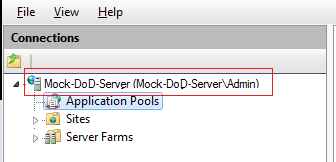
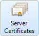
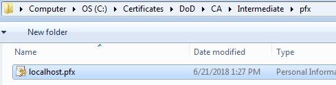
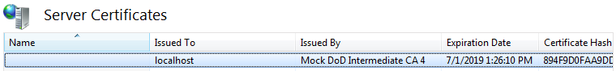
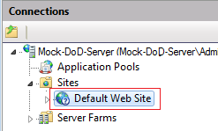
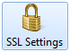
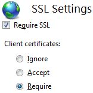

# Create a localhost Server Certificate

[Table of Contents](../../../README.md#table-of-contents) / [Create the Intermediate CA](README.md) / [Create a localhost Server Certificate](README-Create-Server-Cert.md) / Import Into IIS

---------------------------------------------------------------------------------------

1. CD into the Intermediate directory:

       cd C:\Certificates\DoD\CA\Intermediate

2. Create the PFX file:

   > In order for you to import your certificates into a windows server (like IIS), you will need to create a PKCS #12 archive.

       openssl pkcs12 -export -in public/localhost.cer -inkey private/localhost.key -out pfx/localhost.pfx

3. Import PFX into IIS:

   > In order to enable SSL in IIS, you need to import the localhost certificate into IIS.

   | Step | Figure |
   | --- | --- |
   | Open IIS | |
   | Click on the Server |  |
   | Double-Click on `Server Certificates`: |  |
   | Under `Actions`, Click `Import...` |  |
   | Browse to C:\Certificates\DoD\CA\Intermediate\pfx |  |
   | Select the localhost.pfx file: |  |
   | Enter the PFX export password |  |
   | Check `Allow this certificate to be exported` |  |
   | Click `OK` |  |
   | You should now see your certificate in the Server Certificates pane: |  |
   | In the IIS `Connections` pane, click on your website you want to add the certificate to. | |
   | In the IIS `Actions` pane, click on `Bindings...` |  |
   | `Add...` or `Edit...` the `https` binding |  |
   | Change the `SSL certificate:` drop-down to the correct localhost certificate that you just uploaded. |  |
   | Press `OK` |  |
   | Close the bindings window |  |

4. Require PKI to access the website:

   | Step | Figure |
   | --- | --- |
   | In IIS, in the `Connections` pane... |  |
   | Click on the website: |  |
   | Double-click on `SSL Settings` |  |
   | Check `Require SSL` and under `Client certificates:` select the `Require` radio button |  |

> The website should now prompt you for PKI each time you visit, just add your PKI you created under the [Signing tutorial](../Signing/README-Create-Client-Cert.md) to Google Chrome and select it when prompted.

---------------------------------------------------------------------------------------

[Table of Contents](../../../README.md#table-of-contents) / [Create the Intermediate CA](README.md) / [Create a localhost Server Certificate](README-Create-Server-Cert.md) / Import Into IIS